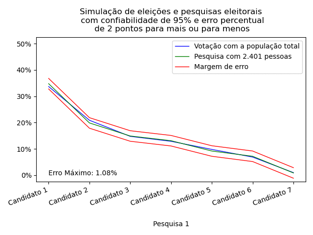

# Statistical Opinion Survey Simulator

    

## About

### What is this project

This statistical opinion survey simulator (called as soss) is a library created by [Eduardo Oliveira](https://github.com/eduardojm/) for simulations of statistical opinion survey. Some examples of applications of this library is to create simulations of an election and vote intentions survey for this election.

### Origins

The statistical opinion survey simulator (called as soss) was initiated with some notebooks on Jupyter and Google Colab for create some simulations of elections to validate a statistical model for a personal project that i'm creating for develop this surveys in the electoral period.

### Current status

The project still is in development and may contain large classes and modules changes in the near future.
